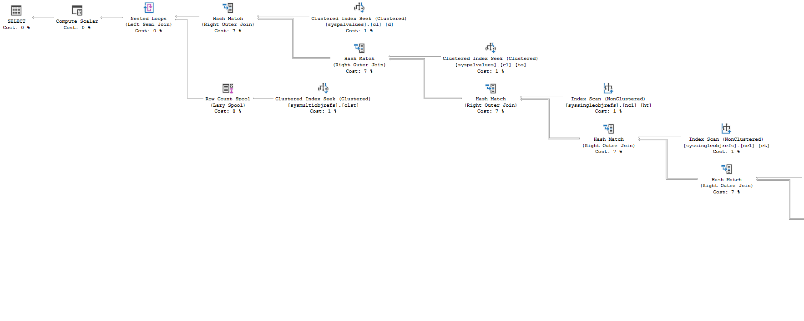
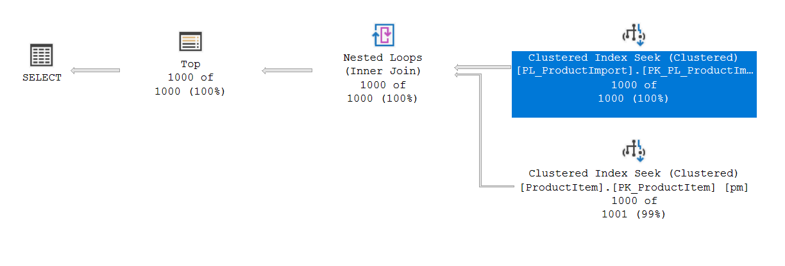
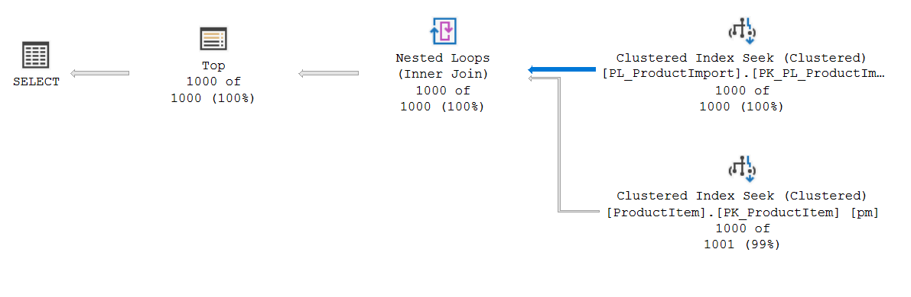
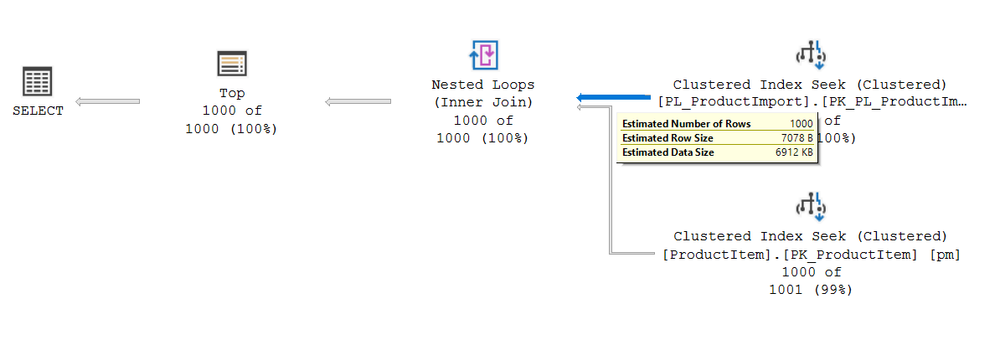
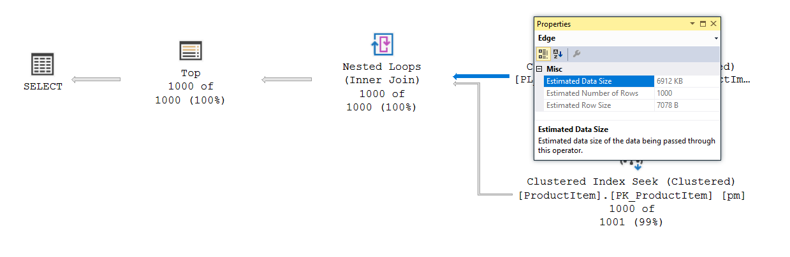
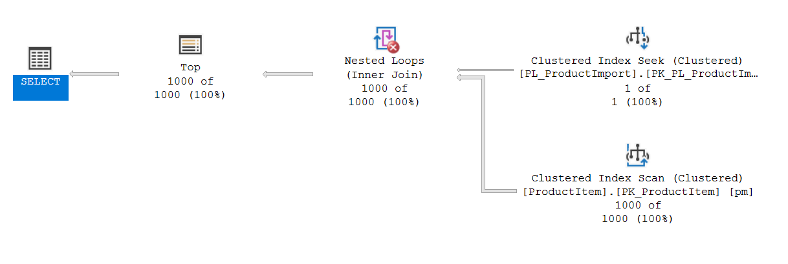
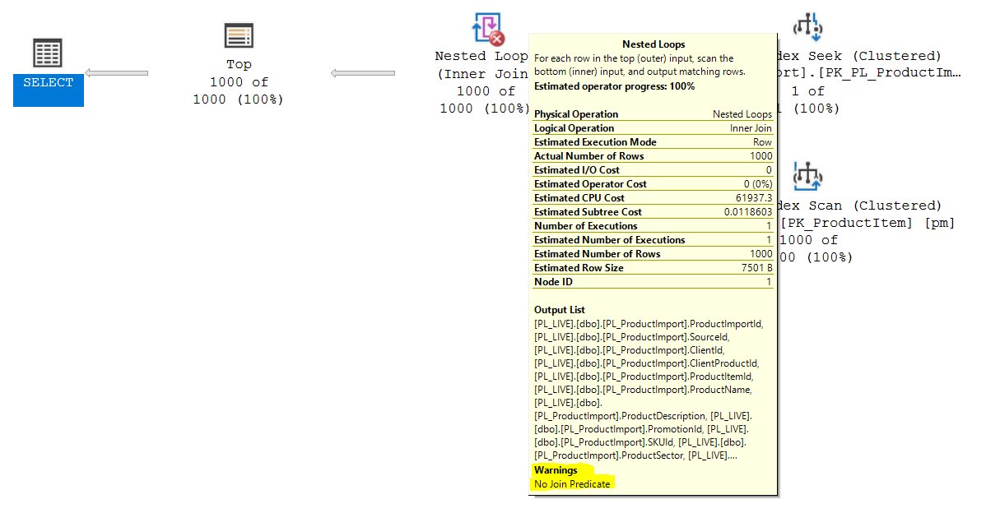
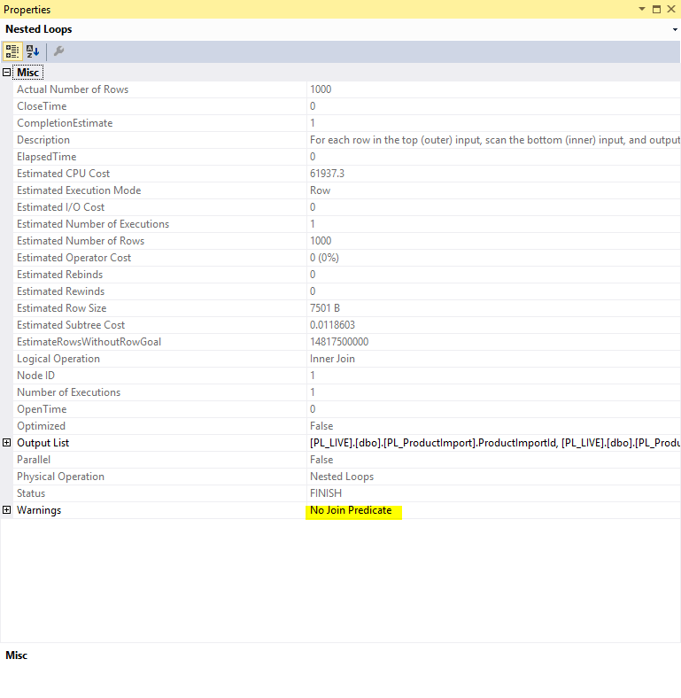
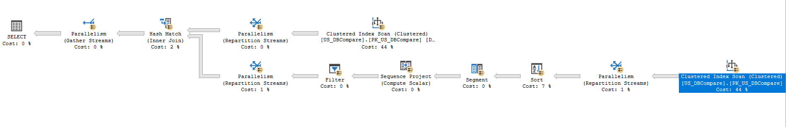
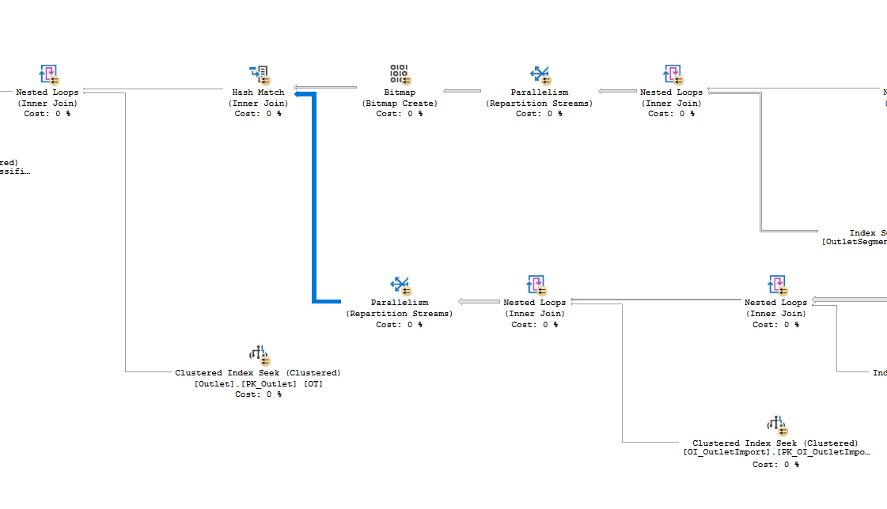

@snap[west]
# Query Tuning: 
## The art of easing the pain!
@snapend

---
@snap[west]
## Content by Johan Kangasniemi 

(and Cyanne Wilcox!)
@snapend

---
@snap[west]
## Contents

An overview of how to tune queries on SQL Server using the available tools in SSMS
@snapend

---
@snap[north-west]
## Why query tune?
@snapend
@snap[centre]
@ul
- Less resource requirement
- Lighter queries tend to run faster
- Lighter queries can allow more queries to run at the same time
- Reduces locking
- Makes best use of the server
@ulend
@snapend

---
@snap[north-west]
## What are we looking for?
@snapend

@snap[centre]
@ul
- Mismatch between Expected and Actual Rows
- "Strange" operators
- Warnings 
@ulend
@snapend

---
@snap[north-west]
## Tools we'll use:
@snapend
@snap[centre]
@ul
- Live Query Stats
- Stats Time and Stats IO
- Estimated and Actual Query plans
@ulend
@snapend

---

@snap[north-west]
## Live Query Stats
@snapend
@snap[centre]
@ul
- "Living" version of the query plan; similar to SSIS flows
- Visual aid to see bottle necks in queries
@ulend
@snapend

---

@snap[north-west]
## Set Statistics Time, Set Statistics IO
@snapend
@snap[centre]
@ul
- Toggle {ON|OFF} in session
- Provide evidence
- Observer effect should be considered
- Easy, Quick, Effective
@ulend
@snapend

---

# DEMO no. 1

---

@snap[north-west]
## What's in a query plan?
@snapend
@snap[centre]
@ul
- Tells what SQL will do
- Estimated/Actual
- Operators
- Pipes/Paths
- Properties
@ulend
@snapend

---

@snap[north-west]
## Query plan: Overview
@snapend
@snap[centre]

@snapend

---

@snap[north-west]
## Query plan: Operator
@snapend
@snap[centre]

@snapend

---

@snap[north-west]
## Query plan: Pipes/Paths
@snapend
@snap[centre]

@snapend

---

@snap[north-west]
## Query plan: Tooltips (Hover over)
@snapend
@snap[centre]

@snapend

---

@snap[north-west]
## Query plan: Properties (F4 in SSMS)
@snapend
@snap[centre]

@snapend

---

@snap[north-west]
## Grant Fritchey's Checklist
@snapend
@snap[centre]
@ul
- First operator
- Warnings
- Most costly operations
- Fat pipes
- Strange operators
- Scans
- Estimated vs Actual
@ulend
@snapend

---

@snap[north-west]
## First Operator
@snapend
@snap[west span-75]

@snapend

@snap[east span-20]
@ul
-@size[50%](Contains the "query level" information)
-@size[50%](Total cost)
-@size[50%](How well it was optimised)
-@size[50%](Missing indexes)
-@size[50%](AND MORE...)
@ulend
@snapend

---

@snap[north-west]
## Warnings
@snapend
@snap[west span-75]

@snapend

@snap[east span-20]
@ul
- Look for the cross
- Click and hover to reveal...
@ulend
@snapend

---

@snap[north-west]
## Warnings - ToolTip
@snapend
@snap[west span-75]

@snapend

@snap[east span-20]
@ul
- Bottom: NO JOIN PREDICATE
@ulend
@snapend

---

@snap[north-west]
## Warnings - Properties
@snapend
@snap[west span-75]

@snapend

@snap[east span-20]
@ul
- Same warning as the tool tip
@ulend
@snapend

---

@snap[north-west]
## Most costly operator
@snapend
@snap[west span-75]

@snapend

@snap[east span-20]
@ul
- Estimated and Actual plans - not Live Query Plan
- Not necessarily bad, could just be expensive
- Business logic dictates whether it's appropriate or not
@ulend
@snapend

---

@snap[north-west]
## Fat pipes
@snapend
@snap[west span-75]

@snapend

@snap[east span-20]
@ul
- Filter rows as early as possible
- Bigger pipe = More data
@ulend
@snapend

---

@snap[north-west]
## Strange Operators
@snapend
@snap[west span-75]

@snapend

@snap[east span-20]
@ul
- Anything you don't know
- More common in complex queries
@ulend
@snapend

---

@snap[north-west]
## Scans
@snapend
@snap[west span-75]

@snapend

@snap[east span-20]
@ul
- Clustered Index Scan/Table Scan
- Selective queries are commonly seeks
- Seeks _can_ be better
- Scans are _sometimes_ appropriate
@ulend
@snapend

---

@snap[north-west]
## Estimated vs Actual
@snapend
@snap[west span-75]

@snapend

@snap[east span-20]
@ul
- Filter rows as early as possible
- Bigger pipe = More data
@ulend
@snapend

---

@snap[north-west]
## Query Tuning is a process
@snapend

@snap[centre]
@ul
- Use Properties
- Look at the plan
- Follow the outputs
@ulend
@snapend

---

@snap[centre]
# DEMO no. 2
@snapend

---

@snap[centre]
# Questions?
@snapend

---
